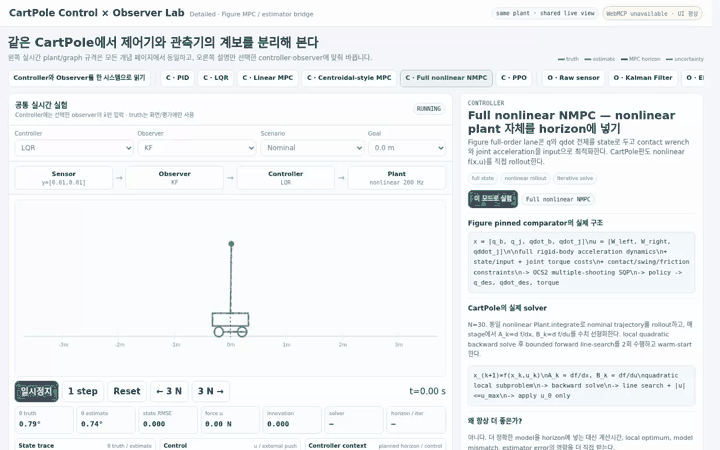

# CartPole MPC

> An interactive control-and-estimation lab for seeing how **PID, LQR, linear MPC, reduced-order centroidal-style MPC, full nonlinear NMPC, PPO, KF, EKF, invariant filtering, and learned estimator corrections** fit together on one shared CartPole plant.

[**Open the live lab →**](https://tinmanlab.github.io/cartpole-mpc/) · [Full NMPC](https://tinmanlab.github.io/cartpole-mpc/#full_nmpc) · [InEKF bridge](https://tinmanlab.github.io/cartpole-mpc/#inekf) · [FOCUS bridge](https://tinmanlab.github.io/cartpole-mpc/#focus)

  

[High-resolution WebM recording](media/cartpole-mpc-demo.webm)

The loop above is a real browser run of the integrated lab: **full nonlinear NMPC + EKF**, under combined sensor noise/model mismatch with pushes, goal changes, live estimation, solver timing, and horizon visualization. Learned/robust estimator variants are taught separately so the front-page demo does not imply that a heuristic bridge is the default estimator.

## Start here

The entire lab uses one control loop:

    nonlinear plant
          ↓
        sensor
          ↓
       observer
       x_hat, P
          ↓
      controller
          ↓
        force u
          ↓
    nonlinear plant

Change only one block and watch what changes in the same live simulation and graphs.

### Controller path

    PID
     ↓ add model + cost
    LQR
     ↓ add finite horizon
    Linear MPC
     ├─ reduced model → Centroidal-style MPC
     └─ full nonlinear model → Full NMPC

    PPO is the parallel learned-policy path:
    online optimization ↔ offline-trained policy

### Observer path

    raw sensor
       ↓ model + uncertainty
    Kalman Filter
       ↓ nonlinear Euclidean dynamics
    EKF

    suitable Lie-group / group-affine structure
       ↓
    InEKF branch

Then learned information can enter at different points:

| Method | What learning changes |
|---|---|
| Lin | learned contact configuration/events |
| Youm / NMN | learned velocity measurement |
| InNKF | posterior state residual |
| CoCo-InEKF | contact-candidate velocity/process covariance |
| FOCUS | continuous FK reliability + observation/process-noise modulation |

## What is actually implemented?

| Runtime mode | What runs in this repo |
|---|---|
| PID | live cascaded feedback controller |
| LQR | Riccati state-feedback controller |
| Linear MPC | N=30 box-constrained receding-horizon optimization |
| Centroidal-style MPC | N=32 reduced horizontal CoM planner + downstream full-state stabilizer |
| Full nonlinear NMPC | N=30 nonlinear rollout, per-stage Jacobians, backward quadratic solve, bounded line search, warm start |
| PPO | frozen robust actor from the related CartPole PPO lab |
| KF | linear Kalman filter |
| EKF | nonlinear prediction + numerical Jacobian covariance propagation |
| SO(2) error bridge | wrapped angle innovation; not the full Hartley humanoid InEKF |
| Learned residual | locally trained residual MLP behind the geometry-aware EKF |
| Adaptive R | innovation-based observation-covariance modulation; FOCUS-style structural bridge, not CoCo |

The distinction between **implementation**, **architecture analogue**, and **paper-only concept** is deliberate. See [Implementation boundaries](docs/IMPLEMENTATION_BOUNDARIES.md).

## Why two MPC pages?

The distinction comes directly from the model-based humanoid stacks reviewed in tinmanlab/figure.

### Centroidal MPC

The pinned humanoid reference optimizes a reduced state:

    state  = centroidal momentum + base pose + joint angles
    input  = contact wrenches + joint velocities

and sends the plan through inverse dynamics / lower-level joint control.

CartPole has no feet or independent contact-wrench variables, so this repo does not invent fake humanoid contacts. Instead it preserves the same hierarchy:

    horizontal CoM reduced model
              ↓
        predictive planner
              ↓
       future CoM reference
              ↓
      full-state stabilizer
              ↓
          CartPole force

### Full nonlinear NMPC

The full-order teaching controller instead puts the **same nonlinear CartPole plant used by the live simulator** inside the prediction horizon.

At every control tick it:

1. warm-starts the previous control sequence,
2. rolls out the nonlinear dynamics,
3. computes stage Jacobians,
4. solves a local quadratic backward pass,
5. runs a bounded forward line search,
6. applies only the first force,
7. shifts the horizon and repeats.

This is a real nonlinear receding-horizon solver. It is not claimed to be a source port of OCS2 multiple-shooting SQP.

## Quick start

### Fastest: GitHub Pages

Open:

**https://tinmanlab.github.io/cartpole-mpc/**

Useful lessons:

- [PID](https://tinmanlab.github.io/cartpole-mpc/#pid)
- [LQR](https://tinmanlab.github.io/cartpole-mpc/#lqr)
- [Linear MPC](https://tinmanlab.github.io/cartpole-mpc/#linear_mpc)
- [Centroidal-style MPC](https://tinmanlab.github.io/cartpole-mpc/#centroidal_mpc)
- [Full nonlinear NMPC](https://tinmanlab.github.io/cartpole-mpc/#full_nmpc)
- [Kalman Filter](https://tinmanlab.github.io/cartpole-mpc/#kf)
- [EKF](https://tinmanlab.github.io/cartpole-mpc/#ekf)
- [InEKF bridge](https://tinmanlab.github.io/cartpole-mpc/#inekf)
- [InNKF](https://tinmanlab.github.io/cartpole-mpc/#innkf)
- [CoCo-InEKF](https://tinmanlab.github.io/cartpole-mpc/#coco)
- [FOCUS](https://tinmanlab.github.io/cartpole-mpc/#focus)

### Run locally

No runtime dependency or build step is required for the checked-in page.

    git clone https://github.com/tinmanlab/cartpole-mpc.git
    cd cartpole-mpc
    python3 serve.py

Open:

    http://localhost:8765

For development:

    npm ci
    npm run check
    python3 scripts/build.py

## A good learning sequence

Do not learn every acronym at once.

1. **PID → LQR**: feedback versus model-derived feedback.
2. **LQR → Linear MPC**: why a horizon and constraints change the problem.
3. **Linear MPC → Centroidal / Full NMPC**: reduced-order versus full nonlinear prediction.
4. **Raw → KF → EKF**: use Sensor noise first, then switch to **Estimator nonlinear bench** with LQR fixed to isolate nonlinear prediction.
5. **EKF → invariant filtering branch**: use the +179°/-179° SO(2) micro-bench to see why error geometry matters; InEKF is not a universal replacement for EKF.
6. **Lin / Youm / InNKF / CoCo / FOCUS**: compare *where* learning enters—contact events, measurements, output residuals, process covariance, or observation reliability. This is a taxonomy, not a chronological ranking.
7. Combine controller and observer under the same noise, model mismatch, glitch, and push scenarios.

More detail:

- [Controllers](docs/CONTROLLERS.md)
- [Observers and learned estimator lineage](docs/OBSERVERS.md)
- [System architecture](docs/ARCHITECTURE.md)
- [Implementation boundaries](docs/IMPLEMENTATION_BOUNDARIES.md)
- [Validation](docs/VALIDATION.md)
- [Algorithm correctness audit](docs/ALGORITHM_AUDIT.md)

## Fixed evidence

The repo ships deterministic evidence under evidence/.

Representative fixed checks from the audited implementation:

- truth-state evaluation is timestamp aligned, so the Truth observer has exactly zero estimation RMSE,
- the LQR gain matches an independent SciPy discrete-Riccati solution to below 2e-7 max absolute error,
- the local four-state model has controllability rank 4 and observability rank 4,
- Linear MPC and the reduced outer MPC solve explicit input-box-constrained horizon problems,
- Full NMPC exposes a 30-step nonlinear horizon and bounded iLQR-style iterations,
- raw finite-difference velocity estimation fails under the fixed high-noise probe where KF remains stable,
- the targeted LQR-fixed estimator nonlinear bench gives about 0.0080 KF RMSE versus 0.00323 EKF RMSE across five fixed seeds,
- the SO(2) regression demonstrates that +179 deg and -179 deg differ by 2 deg, not 358 deg,
- scenario R is tied to the injected Gaussian sensor variance; Q remains a tuned teaching parameter,
- learned/adaptive estimator paths are CartPole evidence only, not humanoid benchmark claims.

Run:

    npm test

## Read comparison results correctly

The controller × observer table is a **common teaching contract**, not an official benchmark table.

- The lab's pole-angle failure envelope is wider than the original PPO Studio training termination.
- The frozen PPO actor can be driven by observer outputs it was not trained with.
- Solver time depends on browser/CPU.
- Lower RMSE in one fixed disturbance/noise cell is not a general algorithm ranking.
- The InNKF-style residual model has no calibrated covariance for its corrected output; the base EKF P is kept separate.
- CoCo has no executable CartPole analogue in this repo because the CartPole state has no persistent foot/contact candidates.

## WebMCP

When the browser exposes the current WebMCP producer surface, the page registers semantic tools for:

- reading current controller/observer/solver state,
- selecting controller, observer, topic, and scenario,
- applying a push,
- stepping or resetting the experiment,
- running deterministic offline controller × observer probes.

The visual UI and WebMCP tools operate the same experiment state. Without WebMCP, the page works normally as an interactive lab.

## Repository structure

    .
    ├── index.html
    ├── src/
    │   ├── engine.js
    │   ├── plant.js
    │   ├── topics.js
    │   ├── app.js
    │   ├── styles.css
    │   └── shell.html
    ├── assets/
    │   ├── ppo_actor.json
    │   └── residual_model.json
    ├── docs/
    ├── evidence/
    ├── media/
    │   ├── cartpole-mpc-demo.gif
    │   └── cartpole-mpc-demo.webm
    ├── scripts/
    │   ├── build.py
    │   └── record_demo.py
    └── tests/

## References and provenance

This project was built by reading the pinned model-based humanoid comparator used in tinmanlab/figure and by reusing the existing tinmanlab CartPole teaching conventions.

Primary architecture reference:

- manumerous/wb_humanoid_mpc at ab5dbfd1df07a33258ce7f2998f5c315f1fcc8b9
- OCS2: https://github.com/leggedrobotics/ocs2

Estimator lineage taught in the UI:

- Hartley et al., Contact-Aided Invariant EKF: https://arxiv.org/abs/1904.09251
- Lin et al., learned contact events: https://proceedings.mlr.press/v164/lin22b.html
- Youm et al., neural measurement network: https://arxiv.org/abs/2402.00366
- InNKF: https://arxiv.org/abs/2503.00344
- CoCo-InEKF: https://arxiv.org/abs/2605.15122
- FOCUS: https://arxiv.org/abs/2609.02222

Related teaching repos:

- https://github.com/tinmanlab/cartpole-sonic
- https://github.com/tinmanlab/cartpole_PPO
- https://github.com/tinmanlab/cartpole-transformer
- https://github.com/tinmanlab/cartpole-diffusion-v02

See [third-party notices](THIRD_PARTY_NOTICES.md).

## Scope

This is a teaching and research prototype, not a production robot controller.

The CartPole versions preserve the **control/estimation structure** needed to understand the algorithms, but they do not reproduce humanoid multi-contact dynamics, hardware state estimation, actuator limits, safety behavior, or OCS2 solver equivalence.
