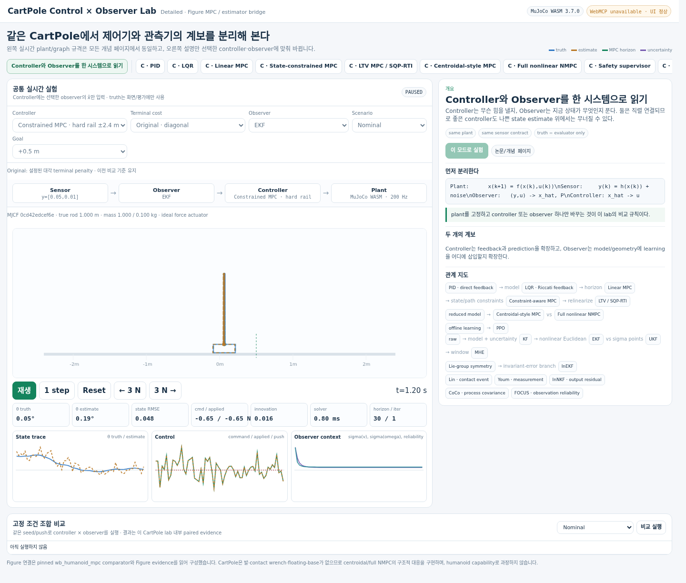

# CartPole MPC

> An interactive control-and-estimation lab for seeing how **PID, LQR, linear/LTV/nonlinear MPC, reduced-order centroidal-style MPC, PPO, KF, EKF, invariant filtering, MHE, learned estimator corrections, and sim2real commissioning** fit together on one shared CartPole plant.

[**Open the live lab →**](https://tinmanlab.github.io/cartpole-mpc/) · [Full NMPC](https://tinmanlab.github.io/cartpole-mpc/#full_nmpc) · [InEKF bridge](https://tinmanlab.github.io/cartpole-mpc/#inekf) · [FOCUS bridge](https://tinmanlab.github.io/cartpole-mpc/#focus)

The browser now runs **official MuJoCo WASM 3.7.0**, using the checked-in `assets/cartpole.xml`. The default is **hard-rail constrained MPC + EKF**. Canvas displays a 2D projection of the compiled MJCF geometry; it is not a separate physics engine. The screenshot is a real browser run. Older GIF/WebM files under `media/` are historical recordings of the earlier JavaScript physics implementation, not evidence of this runtime.

See [runtime, assets and failure contracts](docs/MUJOCO_WASM_RUNTIME.md) for exact versions, masses/inertias, model scope, upstream code reuse and verification commands.

## Terminal cost: explicit comparison

For **Linear MPC** or **Constrained MPC · hard rail**, the **Terminal cost** selector compares **Original · diagonal** with **Riccati · full matrix**. Original remains the default. Riccati retains the coupled tail-cost matrix, checks convergence and residuals, and applies the same choice to live traces, probes and comparison rows. Other controller families do not inherit this option. See [controller semantics](docs/CONTROLLERS.md#terminal-cost-selection) and [the frozen 40-condition validation](docs/VALIDATION.md#frozen-terminal-cost-validation). This adds no solver dependency and does not constitute a hardware safety guarantee.

## Read the evidence, not just the animation

All 28 lessons disclose **implemented / analogue / paper / concept** scope and link their sources. Reading a topic does not switch the live experiment. The actual controller/observer and the Truth/oracle exception are visible. `DONE` means only completion inside a tested envelope, not goal achievement or hardware safety.

Position tracking RMSE and per-component estimation RMSE are separate. Physical quantities use labelled plot scales; mixed-unit legacy aggregates are not shown as controller scores. Reduced CoM plans no longer synthesize uncomputed pole-angle forecasts, and a cost decrease is not labelled optimizer convergence. See [proposal corrections and visual contracts](docs/IMPLEMENTATION_BOUNDARIES.md#educational-and-visualization-contract).

## N-pendulum extension

[Open the N-link experiment](chain.html) uses the same official MuJoCo WASM, a serial chain of unactuated hinges and one cart force. The generator admits 1–32 poles as a resource limit; packaged profiles and controller screens cover 1–8. Model creation, local controllability/observability, numerical solver admission and closed-loop task achievement are separate verdicts. Existing four-state PPO/EKF/MHE/NMPC modes are not automatically generalized. See [definition and tested failure boundaries](docs/N_PENDULUM.md). The main single-pole default is unchanged.

## Start here

The entire lab uses one control loop:

    nonlinear plant
          ↓
        sensor
          ↓
       observer
       x_hat, P
          ↓
      controller
          ↓
        force u
          ↓
    nonlinear plant

Change only one block and watch what changes in the same live simulation and graphs.

### Controller and observer choices

These are independent design axes, not universal upgrade ladders:

    Feedback design:       PID / LQR / learned policy
    Prediction model:      LTI / LTV / nonlinear
    Model order:           reduced / full
    Constraints:           input / state / contact; hard / soft
    Transcription:         single shooting / multiple shooting / collocation
    Numerical method:      QP / SQP / iLQR / IPM
    Execution strategy:    tolerance / iteration budget / RTI phases

    Recursive estimation:  KF / EKF / sigma-point UKF
    Error geometry:        Euclidean / wrapped angle / invariant
    Window optimization:   linear or nonlinear MHE when useful

The browser LTV approximation uses one iLQR-style update, not a reproduction of constrained SQP-RTI. The SO(2) runtime wraps angles; it is not Hartley's contact-aided InEKF. MHE is optional, and a newer method is not automatically better.

Then learned information can enter at different points:

| Method | What learning changes |
|---|---|
| Lin | learned contact configuration/events |
| Youm / NMN | learned velocity measurement |
| InNKF | posterior state residual |
| CoCo-InEKF | contact-candidate velocity/process covariance |
| FOCUS | learned FK reliability and observation fusion (abstract verified; local heuristic differs) |

## What is actually implemented?

| Runtime mode | What runs in this repo |
|---|---|
| PID | coupled PID/PD-style feedback controller |
| LQR | Riccati state-feedback controller |
| Linear MPC | N=30 input-box QP solved by pinned upstream quadprog |
| Constrained MPC | same QP plus explicit world-position rail constraints; invalid/infeasible plans rejected |
| Scenario-risk MPC | N=30 shared-input finite-model ensemble objective; mean + worst-case risk term |
| Centroidal-style MPC | N=32 real [c,c_dot] plan + LQR; no invented full-state forecast |
| LTV approximation | one iLQR-style local update per tick; optimality not verified |
| Full nonlinear NMPC | N=30 nonlinear rollout, per-stage Jacobians, backward quadratic solve, bounded line search, warm start |
| PPO | frozen robust actor from the related CartPole PPO lab |
| KF | linear Kalman filter |
| EKF | nonlinear prediction + numerical Jacobian covariance propagation |
| UKF | sigma-point nonlinear Gaussian propagation with circular angle handling |
| SO(2) error bridge | wrapped angle innovation; not the full Hartley humanoid InEKF |
| Nonlinear shooting MHE | recent-window nonlinear single-shooting estimate with EKF arrival prior; not full constrained NMHE |
| Learned residual | locally trained residual MLP behind the geometry-aware EKF |
| Adaptive R | innovation-based observation-covariance modulation; FOCUS-style structural bridge, not CoCo |

The distinction between **implementation**, **architecture analogue**, and **paper-only concept** is deliberate. See [Implementation boundaries](docs/IMPLEMENTATION_BOUNDARIES.md).

## Why two MPC pages?

A historical pinned humanoid comparator motivated this analogy; its particular state/input choices are not the definition of every centroidal/full-order controller.

### Centroidal MPC

The pinned humanoid reference optimizes a reduced state:

    state  = centroidal momentum + base pose + joint angles
    input  = contact wrenches + joint velocities

and sends the plan through inverse dynamics / lower-level joint control.

CartPole has no feet or independent contact-wrench variables, so this repo does not invent fake humanoid contacts. Instead it preserves the same hierarchy:

    horizontal CoM reduced model
              ↓
        predictive planner
              ↓
       future CoM reference
              ↓
      full-state stabilizer
              ↓
          CartPole force

### Full nonlinear NMPC

The full-order teaching controller instead puts the **same nonlinear CartPole plant used by the live simulator** inside the prediction horizon.

At every control tick it:

1. warm-starts the previous control sequence,
2. rolls out the nonlinear dynamics,
3. computes stage Jacobians,
4. solves a local quadratic backward pass,
5. runs a bounded forward line search,
6. applies only the first force,
7. shifts the horizon and repeats.

This is a real nonlinear receding-horizon solver. It is not claimed to be a source port of OCS2 multiple-shooting SQP.

## Quick start

### Fastest: GitHub Pages

Open:

**https://tinmanlab.github.io/cartpole-mpc/**

Useful lessons:

- [PID](https://tinmanlab.github.io/cartpole-mpc/#pid)
- [LQR](https://tinmanlab.github.io/cartpole-mpc/#lqr)
- [Linear MPC](https://tinmanlab.github.io/cartpole-mpc/#linear_mpc)
- [Scenario-risk MPC](https://tinmanlab.github.io/cartpole-mpc/#robust_mpc)
- [Soft penalty versus hard rail](https://tinmanlab.github.io/cartpole-mpc/#state_mpc)
- [LTV one-update analogue](https://tinmanlab.github.io/cartpole-mpc/#ltv_mpc)
- [Centroidal-style MPC](https://tinmanlab.github.io/cartpole-mpc/#centroidal_mpc)
- [Full nonlinear NMPC](https://tinmanlab.github.io/cartpole-mpc/#full_nmpc)
- [Robust / stochastic MPC](https://tinmanlab.github.io/cartpole-mpc/#robust_mpc)
- [Kalman Filter](https://tinmanlab.github.io/cartpole-mpc/#kf)
- [EKF](https://tinmanlab.github.io/cartpole-mpc/#ekf)
- [MHE](https://tinmanlab.github.io/cartpole-mpc/#mhe)
- [InEKF bridge](https://tinmanlab.github.io/cartpole-mpc/#inekf)
- [InNKF](https://tinmanlab.github.io/cartpole-mpc/#innkf)
- [CoCo-InEKF](https://tinmanlab.github.io/cartpole-mpc/#coco)
- [FOCUS](https://tinmanlab.github.io/cartpole-mpc/#focus)
- [Estimator consistency](https://tinmanlab.github.io/cartpole-mpc/#consistency)
- [System identification](https://tinmanlab.github.io/cartpole-mpc/#sysid)
- [Auto-tuning](https://tinmanlab.github.io/cartpole-mpc/#tuning)
- [Commissioning](https://tinmanlab.github.io/cartpole-mpc/#commissioning)
- [Sim2Real stress stack](https://tinmanlab.github.io/cartpole-mpc/#sim2real)

### Run locally

The checked-in site includes its pinned WASM and QP runtimes. Serve the **whole repository through HTTP**; opening only `index.html` as a local file is unsupported. No CDN or Python control server is required by the public browser runtime.

    git clone https://github.com/tinmanlab/cartpole-mpc.git
    cd cartpole-mpc
    python3 serve.py

Open:

    http://localhost:8765

For development:

    npm ci
    npm run check
    python3 scripts/build.py

## A good learning sequence

Do not learn every acronym at once.

1. **PID → LQR**: feedback versus model-derived feedback.
2. **LQR and Linear MPC**: finite-horizon LQR exists too; compare the chosen cost, constraints and receding execution.
3. **Model and solver axes**: compare fixed/time-varying/nonlinear models, reduced/full order and solver/execution strategies separately.
4. **Raw → KF → EKF**: use Sensor noise first, then switch to **Estimator nonlinear bench** with LQR fixed to isolate nonlinear prediction.
5. **EKF → invariant filtering branch**: use the +179°/-179° SO(2) micro-bench to see why error geometry matters; InEKF is not a universal replacement for EKF.
6. **Lin / Youm / InNKF / CoCo / FOCUS**: compare *where* learning enters—contact events, measurements, output residuals, process covariance, or observation reliability. This is a taxonomy, not a chronological ranking.
7. **Recursive filters versus MHE**: optional windowed optimization, with or without constraints.
8. **Commissioning**: identify the model, calibrate Q_e/R_e, tune Q_c/R_c, validate candidates on declared sets; reusing test outcomes for choices makes them development evidence.
9. Combine controller and observer under sensor, model, actuator/latency, bias, glitch, and push stress.

More detail:

- [Controllers](docs/CONTROLLERS.md)
- [Observers and learned estimator lineage](docs/OBSERVERS.md)
- [System architecture](docs/ARCHITECTURE.md)
- [Implementation boundaries](docs/IMPLEMENTATION_BOUNDARIES.md)
- [Validation](docs/VALIDATION.md)
- [Algorithm correctness audit](docs/ALGORITHM_AUDIT.md)
- [Commissioning and auto-tuning](docs/COMMISSIONING.md)
- [Linear/LTV/nonlinear/hybrid model hierarchy](docs/MODEL_HIERARCHY.md)
- [Coverage matrix](docs/COVERAGE_MATRIX.md)
- [Transfer map to Figure/humanoids](docs/FIGURE_TRANSFER.md)
- [Sim2Real failure diagnosis](docs/SIM2REAL_DIAGNOSIS.md)
- [Tuning methods](docs/TUNING_METHODS.md)
- [Experiment design and acceptance](docs/EXPERIMENT_DESIGN.md)
- [Robot-scale commissioning checklist](docs/ROBOT_SCALE_CHECKLIST.md)
- [Theory failure map](docs/THEORY_FAILURE_MAP.md)
- [Reference / native-authority map](docs/REFERENCE_MAP.md)

## Correctness and native references

Read [the 2026-10-04 sim2real correctness review](docs/SIM2REAL_CORRECTNESS_REVIEW_2026-10-04.md) before interpreting commissioning results as robot readiness. It records reproduced observer/freshness/covariance/supervisor defects, corrections, essential deployment gaps, and a native numerical-reference lane using **SciPy, OSQP and MuJoCo**.

The original review documented a 3/4 strict first-action parity failure in the handwritten browser QP optimizer. That optimizer has now been replaced by pinned upstream quadprog. **All four unchanged OSQP parity cases pass**, together with an active hard-rail comparison. WASM/native replay uses the exact same MJCF. Read the current receipts linked in [MuJoCo WASM runtime](docs/MUJOCO_WASM_RUNTIME.md); the earlier review and `native_reference_before.json` are historical evidence. Hardware admission remains **NOT_EVALUATED**.

## Fixed evidence

The repo ships fixed-seed numerical evidence under `evidence/`. Timing values are host-dependent; they are not deterministic or hard-real-time guarantees.

Representative checks are scoped to their recorded revision/configuration, not timeless performance numbers:

- truth-state evaluation is timestamp aligned, so the Truth observer has exactly zero estimation RMSE,
- the LQR gain matches an independent SciPy discrete-Riccati solution to below 2e-7 max absolute error,
- the local four-state model has controllability rank 4 and observability rank 4,
- Linear MPC and the reduced outer MPC solve explicit input-box-constrained horizon problems,
- Full NMPC exposes a 30-step nonlinear horizon and bounded iLQR-style iterations,
- raw finite-difference velocity estimation fails under the fixed high-noise probe where KF remains stable,
- the targeted LQR-fixed nonlinear bench compares estimator behavior under a fixed setup; legacy mixed-unit scores are not physical tracking error or general KF/EKF rankings,
- the SO(2) regression demonstrates that +179 deg and -179 deg differ by 2 deg, not 358 deg,
- scenario R is tied to the injected Gaussian sensor variance; Q remains a tuned teaching parameter,
- learned/adaptive estimator paths are CartPole evidence only, not humanoid benchmark claims,
- colored noise, dropout, stuck-sensor, command jitter, torque-speed and thermal-derating probes are separate failure classes rather than one generic "reality gap",
- integration refinement is checked explicitly before interpreting tuning failures,
- low-dimensional controller-estimator co-tuning is admitted only through held-out validation/test and is not mislabeled as ContEst/DiffTune.

Run:

    npm test

For the slower offline commissioning experiment:

    npm run commission

This executes actual MuJoCo WASM and writes `evidence/commissioning.json` and `evidence/diagnosis.json`, including engine/asset/source identity. Identification and sensor-noise knowledge are still explicitly simulated, not a real measured-data calibration.  The diagnosis layer maps measured failure signatures back to model, estimator, constraint, actuator, timing, or tuning hypotheses; it is a deterministic triage aid, not an autonomous proof of root cause.

## Read comparison results correctly

The controller × observer table is a **common teaching contract**, not an official benchmark table.

- The lab's pole-angle failure envelope is wider than the original PPO Studio training termination.
- The frozen PPO actor can be driven by observer outputs it was not trained with.
- Solver time depends on browser/CPU.
- Lower RMSE in one fixed disturbance/noise cell is not a general algorithm ranking.
- The InNKF-style residual model has no calibrated covariance for its corrected output; the base EKF P is kept separate.
- CoCo has no executable CartPole analogue in this repo because the CartPole state has no persistent foot/contact candidates.

## Commissioning, not just demos

The repo now includes a slow offline commissioning lane in addition to the browser lab:

    system ID
    → estimator calibration + NIS/NEES consistency
    → controller tuning
    → held-out validation/test gate
    → combined sim2real stress

The receipt records both accepted and rejected candidates according to the actual held-out scores. These decisions are recomputed rather than forcing a named method to win. Inspect `evidence/commissioning.json` for its recorded numerical outcomes and exact source/model provenance; a later documentation change does not regenerate that campaign.

This is intentional. A tuner result is not a controller until it passes held-out admission.

See [Commissioning](docs/COMMISSIONING.md) and [Coverage matrix](docs/COVERAGE_MATRIX.md).

## WebMCP

When the browser exposes the current WebMCP producer surface, the page registers semantic tools for:

- reading current controller/observer/solver state,
- selecting controller, observer, topic, and scenario,
- applying a push,
- stepping or resetting the experiment,
- running deterministic offline controller × observer probes.

The visual UI and WebMCP tools operate the same experiment state. Without WebMCP, the page works normally as an interactive lab.

## Repository structure

    .
    ├── index.html
    ├── src/
    │   ├── engine.js
    │   ├── plant.js
    │   ├── topics.js
    │   ├── app.js
    │   ├── commissioning.js
    │   ├── styles.css
    │   └── shell.html
    ├── assets/
    │   ├── ppo_actor.json
    │   └── residual_model.json
    ├── docs/
    ├── evidence/
    ├── media/
    │   ├── cartpole-mpc-demo.gif
    │   └── cartpole-mpc-demo.webm
    ├── scripts/
    │   ├── build.py
    │   └── record_demo.py
    └── tests/

## References and provenance

This project was built by reading the pinned model-based humanoid comparator used in tinmanlab/figure and by reusing the existing tinmanlab CartPole teaching conventions.

Primary architecture reference:

- manumerous/wb_humanoid_mpc at ab5dbfd1df07a33258ce7f2998f5c315f1fcc8b9
- OCS2: https://github.com/leggedrobotics/ocs2

Estimator lineage taught in the UI:

- Hartley et al., Contact-Aided Invariant EKF: https://arxiv.org/abs/1904.09251
- Lin et al., learned contact events: https://proceedings.mlr.press/v164/lin22b.html
- Youm et al., neural measurement network: https://arxiv.org/abs/2402.00366
- InNKF: https://arxiv.org/abs/2503.00344
- CoCo-InEKF: https://arxiv.org/abs/2605.15122
- FOCUS: https://arxiv.org/abs/2609.02222

Related teaching repos:

- https://github.com/tinmanlab/cartpole-sonic
- https://github.com/tinmanlab/cartpole_PPO
- https://github.com/tinmanlab/cartpole-transformer
- https://github.com/tinmanlab/cartpole-diffusion-v02

See [third-party notices](THIRD_PARTY_NOTICES.md).

## Scope

This is a teaching and research prototype, not a production robot controller.

The CartPole versions preserve the **control/estimation structure** needed to understand the algorithms, but they do not reproduce humanoid multi-contact dynamics, hardware state estimation, actuator limits, safety behavior, or OCS2 solver equivalence.
